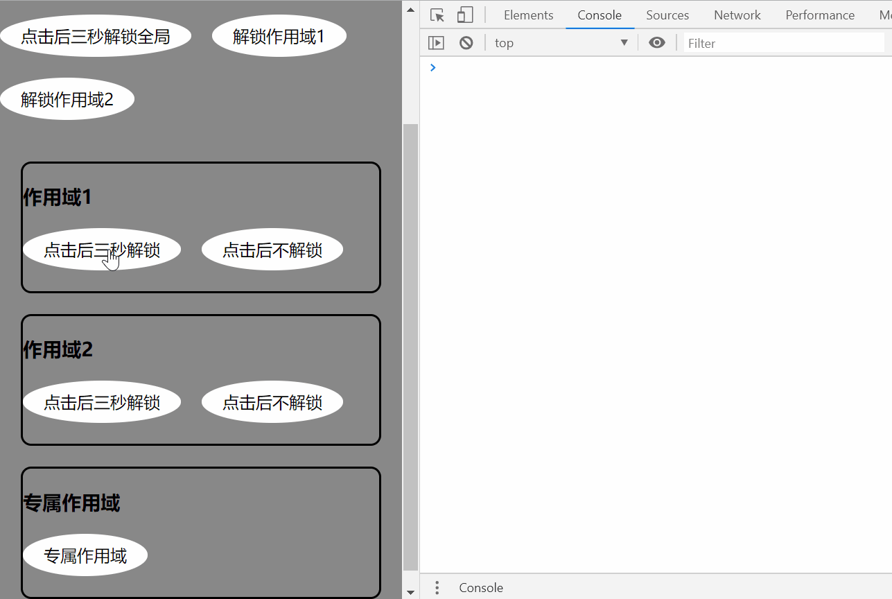

## Interceptor 拦截器

拦截器是一个工具组件，它的主要功能是拦截函数的再执行。适用于拦截连点请求情景下的业务需求。

举例来说，一个新增按钮，它的点击操作将会发起一个请求，这个请求会添加一则数据进入数据库，如若不进行连点拦截，那么在用户快速点击多次的情况下，将会有多条相同的数据被加入数据库中。



## 拦截器的作用域

拦截器的作用域是拦截器拦截的范围区域，当该作用域被上锁，属于该作用域内的所有函数调用都将被拦截。

+ 全局作用域
+ 独立作用域
+ 专属作用域

> 场景说明： A函数被添加到了全局作用域，B1、B2被添加到了独立作用域1，C1、C2被添加到了独立作用域2、D1、D2则创建了专属作用域中。当A处于执行过程中，B1、B2、C1、C2、D1、D2都将被拦截；当B1处于执行过程中，B1、B2的函数调用被拦截，同理当C2处于执行过程中时，C1、C2会被拦截；D1处于执行过程中时，D1会被拦截；D2同D1处理。

#### 引用全局作用域

```javascript
import { Interceptor } from 'mini-uc';

// 引用全局作用域
const globalScope = Interceptor.use(); 
```

#### 创建/引用独立作用域

你可以根据不同场景，创建多个独立作用域，每个拦截作用域将独立拦截函数的调用执行。

```javascript
import { Interceptor } from 'mini-uc';

// 创建了一个名为Asia的拦截作用域
const scope1 = Interceptor.use('Asia');
// 创建了一个名为Europe的拦截作用域
const scope2 = Interceptor.use('Europe');
// 因为上面已经创建过Asia的拦截作用域，所以此处是引用Asia拦截作用域
const asia = Interceptor.use('Asia');
```

##### 清除拦截作用域的副作用影响

作用域一旦创建将会在项目级别的范围产生作用，组件A、组件B引用了作用域1，即便A\B处于不同的位置，但作用域1仍然是同一个。

因此在不使用时需要及时清除作用域，以消除此作用域的影响

```javascript
import React from 'react';
import { Interceptor } from 'mini-uc';

class C extends React.Component {
  constructor(props) {
    super(props);
    const scope = Interceptor.use('Asia');
    // ...
  }

  componentWillUnmount() {
    // 组件销毁时移除作用域
    Interceptor.destory('Asia');
  }

  // ...
}
```

#### 使用专属作用域

专属作用域的意思是为单一函数创建单独的作用域空间

```javascript
import { Interceptor } from 'mini-uc';

const fn = () => {
  console.log('fn');
}

const scopedFn1 = Interceptor.add(fn);
const scopedFn2 = Interceptor.add(fn);
```

上述例子对同一个方法fn设立了专属作用域，并返回了包装后的方法，而scopedFn1和scopedFn2是两个专属作用域的不同函数。

## 拦截作用域对象

`Interceptor.use()`方法会返回拦截作用域对象(IScope)，作用域对象IScope的属性如下：

```typescript
export interface IScope {
  name: string | symbol,
  add: (fn: Function) => (...params: any) => any,
  forceFree: () => void,
  isLock: () => boolean,
}
```

作用域对象有四个属性：

+ name是作用域对象的标志；
+ add方法是将一个方法加入该拦截作用域中，并返回一个包装后的方法；
+ forceFree方法，将该拦截作用域强制解锁；
+ isLock方法，判断该作用域是否上锁。

#### 为拦截作用域添加函数成员

`scope1.add`方法接收一个函数，并返回一个包装后的属于scope1拦截作用域的函数，被包装的方法的原型对象上存在一个forceFree方法，用以在该函数逻辑结束时，解锁当前作用域的锁定状态。

若scope1拦截作用域处于未上锁的状态，被包装后的方法一经调用即上锁，直到手动调用解锁函数。

```javascript
import { Interceptor } from 'mini-uc';

function fn() {
  console.log('fn');
  setTimeout(() => {
    console.log('解除锁定');
    fn.prototype.forceFree();
  }, 3000);
}

const scope = Interceptor.use('scope');
const packedFn = scope.add(fn);

packedFn();
packedFn();

// 只会打印一个fn, 和一个解除锁定
```

## 在React中的实践

```javascript
import * as React from 'react';
import { Interceptor } from 'mini-uc';
import * as styles from './index.modules.scss';

class PrivateCodeCard extends React.Component<{}, {}> {
  constructor(props: {}) {
    super(props);
    const scope = Interceptor.use();
    const scope1 = Interceptor.use('scope1');
    const scope2 = Interceptor.use('scope2');
    this.onClickGlobalBtn = scope.add(this.onClickGlobalBtn.bind(this));
    this.onClickFreeScope1 = this.onClickFreeScope1.bind(this);
    this.onClickFreeScope2 = this.onClickFreeScope2.bind(this);
    this.onClickScope11 = scope1.add(this.onClickScope11.bind(this));
    this.onClickScope12 = scope1.add(this.onClickScope12.bind(this));
    this.onClickScope21 = scope2.add(this.onClickScope21.bind(this));
    this.onClickScope22 = scope2.add(this.onClickScope22.bind(this));
  }

  onClickGlobalBtn() {
    console.log('点击了全局按钮');
    setTimeout(() => {
      this.onClickGlobalBtn.prototype.forceFree();
      console.log('解锁全局');
    }, 3000);
  }

  onClickFreeScope1() {
    const scope1 = Interceptor.use('scope1');
    scope1.forceFree();
    console.log('作用域1已经解除占用');
  }

  onClickFreeScope2() {
    const scope2 = Interceptor.use('scope2');
    scope2.forceFree();
    console.log('作用域2已经解除占用');
  }

  onClickScope11() {
    console.log('点击了作用域1按钮');
    setTimeout(() => {
      this.onClickScope11.prototype.forceFree();
      console.log('解锁作用域1');
    }, 3000);
  }

  onClickScope12() {
    console.log('点击了作用域1按钮，将一直占用');
  }

  onClickScope21() {
    console.log('点击了作用域2按钮');
    setTimeout(() => {
      this.onClickScope21.prototype.forceFree();
      console.log('解锁作用域2');
    }, 3000);
  }

  onClickScope22() {
    console.log('点击了作用域2按钮，将一直占用');
  }

  render() {
    return (
      <div className={styles.container}>
        <h3>全局作用域</h3>
        <p>请打开控制台查看打印结果</p>
        <div className={styles.btn} onClick={this.onClickGlobalBtn}>点击后三秒解锁全局</div>
        <div className={styles.btn} onClick={this.onClickFreeScope1}>解锁作用域1</div>
        <div className={styles.btn} onClick={this.onClickFreeScope2}>解锁作用域2</div>
        <div className={styles.scope}>
          <h3>作用域1</h3>
          <div className={styles.btn} onClick={this.onClickScope11}>点击后三秒解锁</div>
          <div className={styles.btn} onClick={this.onClickScope12}>点击后不解锁</div>
        </div>
        <div className={styles.scope}>
          <h3>作用域2</h3>
          <div className={styles.btn} onClick={this.onClickScope21}>点击后三秒解锁</div>
          <div className={styles.btn} onClick={this.onClickScope22}>点击后不解锁</div>
        </div>
      </div>
    )
  }
}

export default PrivateCodeCard;
```