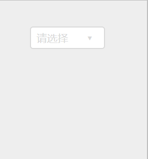

## SelectMenu 下拉选择

使用 `tabIndex` 属性实现的简易的下拉选择器，利用焦点事件实现选择菜单的展开与关闭，而不用在 `body` 或者其它地方增加监听事件。但也因为焦点事件，使选择菜单并不具备丰富的功能表现，在一些简单的下拉选择场景中可以使用该组件，而不会污染其他地方的监听事件。



### API

| 成员 | 说明 | 类型 | 默认值 | 版本 |
| --- | --- | --- | --- | --- |
| listData | 选择菜单的JSON数据 | ListDataItem[] | [] | |
| initialSelectedKey | 初始化时选择的项，该值需是 `listData` 中给出的 `key` 值，否则将不选择任何项。 | string | '' | |
| placeholder | 当没有选择任何项时选择框显示的提示文字。 | string | '' | |
| tabIndex | 元素的 tab 键控制次序（当 tab 键用于导航时），当使用 tab 选中该下拉选择组件时，可以使用 enter 键来唤起选择菜单 | number | -1 | |
| menuClassName | 附加在下拉选择组件最外层的 className，可以使用该 className 来覆盖样式 | string | '' | |
| style | 附加在下拉选择组件最外层的style，可以在这里指定该组件的宽度（默认的宽度为100%，撑满父级容器）。 | React.CSSProperties | | |
| onSelect | 选择回调，在选择时会触发该事件，被禁用的也会触发该选择事件 | (selectedKey: string, selectObj: ListDataItem) => void | | |
| onBeforeSelected | 选择回调，在真正设置 key 值之前触发该事件，可以返回一个 `true` 值来阻止选择。 | (selectedKey: string, selectObj: ListDataItem) => boolean\|null\|undefined | | |
| onSelected | 选择回调，在设置 key 值之后触发该事件。 | (selectedKey: string, selectObj: ListDataItem) => void | | |

### ListDataItem

listData 是一个 ListDataItem 数组，ListDataItem 是一个 JSON 对象，其 TS 声明为：

```typescript
export interface ListDataItem {
  key: string,
  value: string,
  disabled?: boolean,
  [key: string]: any,
}
```

相关描述参见下表：

| 属性 | 说明 | 类型  | 版本 |
| --- | --- | --- | --- |
| key | 必须属性，类似于 id，listData 的每一项都应该具备唯一不同的 key 值。 | string | |
| value | 必须属性，该选项的值、显示的文本。 | string | |
| disabled | 选填属性，设置为 `true` 时，该选项将被禁用 | boolean | |
| [key] | 其他选填属性，你可以在这个对象中注入其他数据，这些数据将不会被组件使用。 | any | |


### 特殊 key 值的内置处理

对于传入的 listData 数据，组件内部会对其进行处理，保证其正常调用。对于一些特殊的 key 值，会有如下内置处理：

+ 对于值为 `''` 的 key 值，组件将会抛出异常。

+ 若有两项及两个以上的成员拥有同一个 key 值，那么选项中将只展示最后一个使用相同 key 值的选项，之前的选项将会被过滤，并且在开发环境下，在控制台中给出警告。